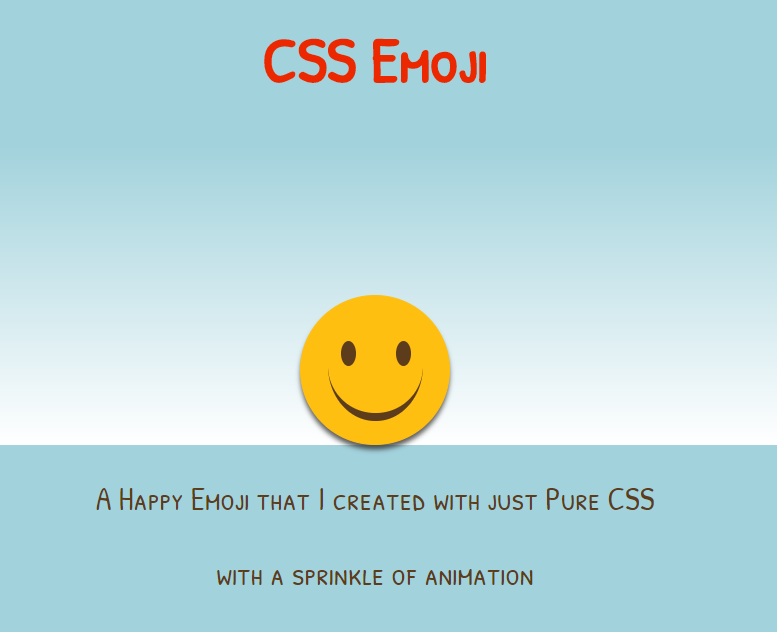

# Cascading Coder’s Creative Code Challenge

## Task
### 🐝🍈 Recreate Your Favorite EMOJI 💥🏋️‍♀️

## Project
My favorite emoji happens to be the happy emoji. So,  I created one with just Pure CSS and with a sprinkle of animation

### Screenshot

Happy Emoji - Screenshot

## Technology

- HTML5
- CSS3

## Contributing

This repository is part of my learning journey.

For details, check out [CONTRIBUTING.md](CONTRIBUTING.md).

## Contact / Social Media

- Twitter – [@seetechnologic](https://twitter.com/seetechnologic)
- GitHub - [https://github.com/JavaVista/](https://github.com/JavaVista/)
- LinkedIn - [Javier Carrion](https://www.linkedin.com/in/technologic)

### License

Distributed under the MIT License. Note: Copyright and license text of third party modules are included in their source code.

See the 
for more information.